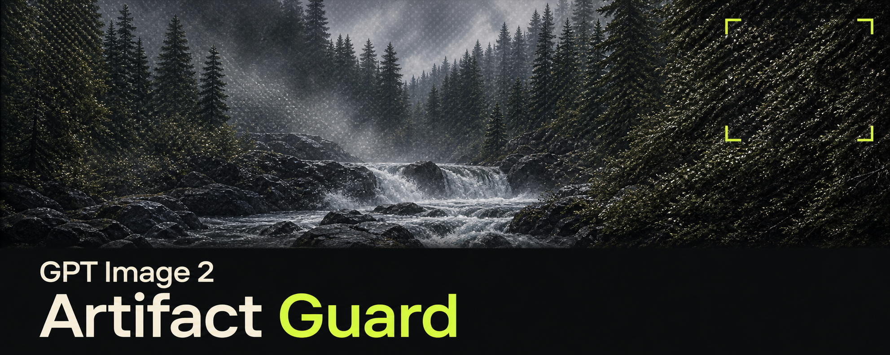

# GPT Image 2 Artifact Guard

**Version 1.0.0 · Ready to test**

A skill for ChatGPT / Work and Codex that checks image prompts, reviews unwanted artifacts and plans limited recovery attempts. It addresses fine triangular and diamond checker patterns, false microdetail and unnatural photographic people while protecting the detail you asked for.

It creates **complete prompts with a task-specific anti-artifact layer**. For photographic people, that layer also covers believable skin, eyes, hair, pose, contact and lighting. It does not impose realism on intentional illustration or CGI.

This is an instruction workflow, not an image filter or model patch. It cannot guarantee artifact-free output or “100% real” people. Visual mitigation effectiveness has not been measured.

## Install and get onboarded

Copy one complete setup prompt into the product where you want to use the skill:

| Product | Copy this prompt | What it requests |
| --- | --- | --- |
| ChatGPT / Work | [Install and onboard in Work](prompts/install-chatgpt-work.txt) | Import one skill through the host's supported workflow, verify its status, then explain its use |
| Codex | [Install and onboard in Codex](prompts/install-codex.txt) | Install one project-local skill from the pinned release, check discovery, then explain its use |

The prompts include version checks, existing-installation checks, a short introduction and three starter requests. They do not authorize image generation, global installation, paid providers or uploads.

This repository is **private**. Use authorized GitHub access or attach the standalone skill ZIP from the [v1.0.0 release](https://github.com/FrameCoreWorks/gpt-image-2-artifact-guard/releases/tag/v1.0.0). Work may require a manual importer or administrator approval. Reading an attached ZIP is not a persistent install, and a prompt cannot bypass host permissions.

[Step-by-step setup and troubleshooting](docs/getting-started.md) · [Copy-ready starter prompts](docs/starter-prompts.md) · [First-test checklist](docs/ready-to-test.md)

## Use it

In ChatGPT, select the installed skill with `@`. In Codex, use `$gpt-image-2-artifact-guard`. [OpenAI invocation guidance](https://learn.chatgpt.com/docs/build-skills)

Try this after selecting it:

```text
Preflight only. Return a complete revised prompt, without generating:
A photorealistic waist-up photograph of an adult repairing a bicycle
in a daylight workshop. Preserve subtle natural skin, a believable
grip and lighting shared by the person and room.
```

Or attach an image and ask:

```text
Review this image for tiny diagonal checker patterns and unnatural
photographic people. Separate visible observations from uncertainty.
Do not edit or generate.
```

For an identity-sensitive edit comparison, attach both the original and edited images. The skill responds in your language; the distributed instructions and onboarding documentation are in English.

## Four modes

- **Onboarding:** explains invocation, features, expected outputs and limits without generating or changing installation state.
- **Preflight:** preserves the brief and writes a complete prompt with only the relevant safeguards.
- **Review:** inspects available images and separately assesses periodic texture, photographic plausibility and preservation.
- **Recovery:** proposes one targeted intervention at a time. Retrying needs authorization, with a default ceiling of two additional attempts or your lower limit.

Regular weave, gingham, droplets, grain and smooth skin are not automatically defects. A cleaner-looking image still fails if it loses required texture, changes the person or alters exact lettering. “Realistic” describes a visual target, not proof that an image is a photograph.

## Release files

| Asset | Contents |
| --- | --- |
| `gpt-image-2-artifact-guard-skill-1.0.0.zip` | One standalone skill folder with instructions, resources and metadata |
| `gpt-image-2-artifact-guard-plugin-1.0.0.zip` | The identical skill plus a plugin manifest, for supported plugin workflows |
| `INSTALL-CHATGPT-WORK-1.0.0.txt` | The copy-ready Work setup prompt |
| `INSTALL-CODEX-1.0.0.txt` | The copy-ready Codex setup prompt |
| `SHA256SUMS-1.0.0.txt` | SHA-256 checksums for all four assets above |

Choose one package variant per scope. Neither adds a generator. No runtime scripts, API integration, MCP server, telemetry, third-party model or user reference images are bundled. This release is not listed in the public plugin directory.

## Evidence and test status

[Verification record](docs/verification.md) distinguishes structural checks, text-only smoke tests, file installation, live host activation and image-quality evaluation. Passing one does not prove the others. Real Work import, automatic discovery and a controlled visual benchmark remain test gates, not claimed results.

The [evidence register](skills/gpt-image-2-artifact-guard/references/evidence-register.md) separates official guidance, firsthand community reports and untested workflow hypotheses. No universal cause or cure for these patterns has been established here. The banner deliberately illustrates microtexture; it is not a repair demonstration or benchmark result. [Banner provenance](docs/readme-banner-v6.md)

## Repository map

- [Core skill](skills/gpt-image-2-artifact-guard/SKILL.md)
- [Pattern morphology](skills/gpt-image-2-artifact-guard/references/pattern-morphology.md) and [human photorealism](skills/gpt-image-2-artifact-guard/references/human-photorealism.md)
- [Prompt patterns](skills/gpt-image-2-artifact-guard/references/prompt-patterns.md) and [review/recovery](skills/gpt-image-2-artifact-guard/references/qa-and-recovery.md)
- [Design decisions](docs/design-decisions.md), [audit and v1 disposition](docs/skill-audit-2026-09-07.md), [changelog](CHANGELOG.md)
- [Test cases](tests/cases.json) and [evaluation protocol](tests/evaluation-protocol.md)

## Build and verify

Python 3.9+ and the standard library only, from the repository root:

```sh
python3 -B -m unittest discover -s tests -v
python3 -B scripts/package.py
python3 -B scripts/package.py --check
```

The build is deterministic and refuses to overwrite a differing artifact of the same version. Generated assets live in `dist/` and are distributed through GitHub releases, not committed as build files. Bump the version before changing an already released package.

Author: FrameCore Works. The repository remains private. No public-distribution license has been selected; this test release does not grant an open-source license.
